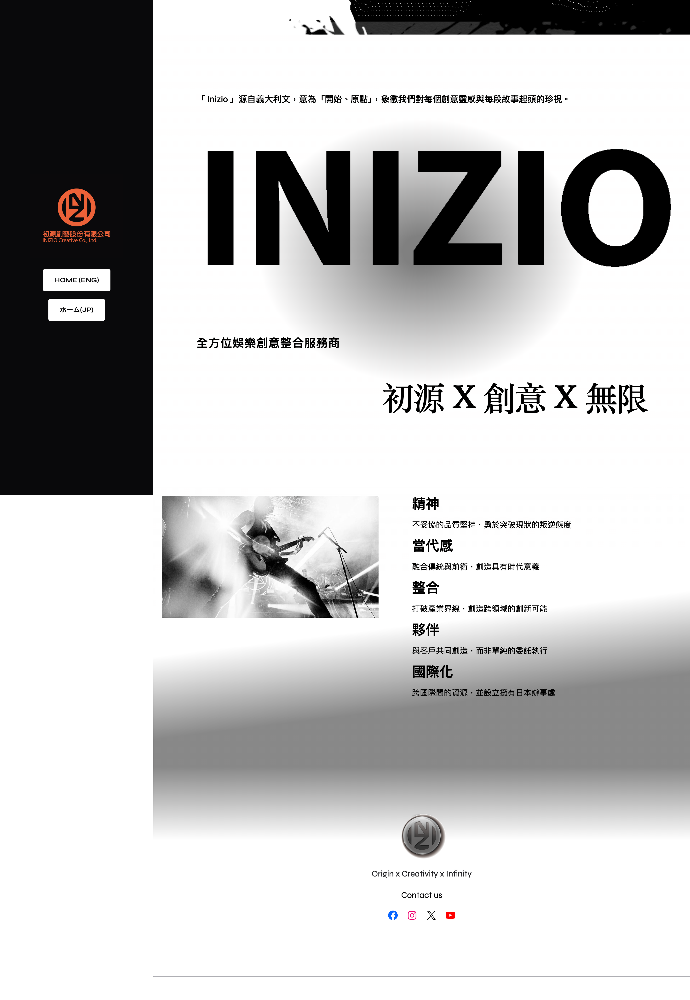
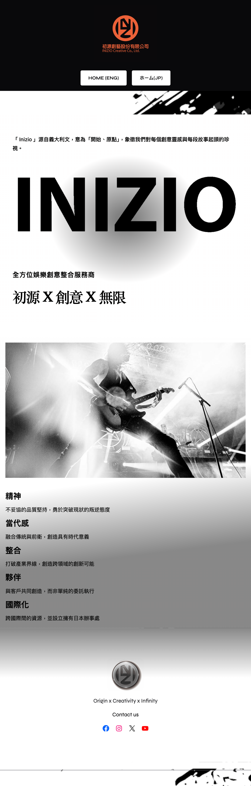
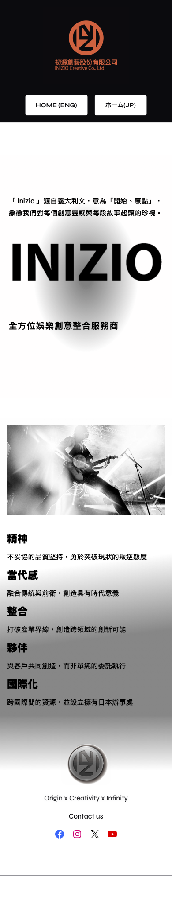

# Inizio Corp 音樂公司官方網站前端專案

## 專案簡介

本專案為音樂公司官方網站之前端整理與作品集展示專案，原始內容來自 WordPress 網站，後續將頁面結構、圖片素材、HTML / CSS 與專案文件重新整理為較乾淨的靜態前端架構。

網站內容包含 Home、About、Music Label、Artist、Service、Our Partner、Contact Us 等頁面，並整理多語言頁面、響應式畫面截圖與 Figma PDF 參考檔，作為前端作品集展示使用。

## 線上展示

https://inizio-corp.com/

## 專案狀態

本專案已完成主要頁面整理、靜態 HTML 預覽、響應式畫面檢視、畫面截圖整理、Figma 響應式畫面整理、GitHub 專案上傳與線上展示部署。

## 專案目的

此專案主要目標為：

- 將既有 WordPress 網站內容整理為靜態前端專案
- 練習 HTML、CSS 與響應式版面整理
- 建立清楚的專案資料夾結構
- 整理桌機、平板與手機版畫面截圖
- 製作 Figma 響應式畫面整理與 UI 設計參考檔
- 製作網站優化紀錄文件
- 作為前端作品集與履歷展示用途

## 使用技術

- HTML5
- CSS3
- Basic JavaScript
- Responsive Web Design
- Git / GitHub
- WordPress 原始內容整理
- Figma 響應式畫面整理與 UI 參考

## 頁面內容

本專案包含以下主要頁面：

- Home
- About
- Music Label
- Artist
- Service
- Our Partner
- Contact Us

部分頁面包含多語言版本，並依照原網站內容進行整理。

## 專案特色

- 將 WordPress 網站內容轉換並整理為靜態前端架構
- 重新整理 HTML 結構，使頁面內容更清楚
- 將圖片素材依照頁面與用途分類
- 製作桌機、平板與手機版完整頁面截圖
- 將完成後的響應式畫面整理至 Figma，作為 UI 視覺參考與作品集輔助展示
- 建立適合作品集展示的專案文件
- 保留原網站視覺風格並整理前端檔案
- 針對網站效能、圖片、結構與響應式呈現整理優化紀錄

## 響應式支援

本專案針對不同裝置尺寸進行畫面檢視與截圖整理，包含：

- Desktop
- Tablet
- Mobile

完整頁面截圖已依裝置分類存放於 GitHub 專案中的 `assets/screenshots/` 資料夾，方便檢視不同裝置下的頁面呈現效果。

## Figma 設計參考

本專案前端畫面完成後，另將 Desktop、Tablet、Mobile 各裝置畫面截圖整理至 Figma，作為響應式畫面整理、UI 視覺參考與作品集展示輔助文件。

此 Figma 檔案主要用途包含：

- 整理不同裝置尺寸的頁面畫面
- 作為 UI 視覺呈現與版面對照參考
- 輔助作品集展示與專案說明

此 Figma 檔案主要作為完成畫面的整理與參考，並非前期設計切版依據。

Figma 檔案可參考：

- [Figma 設計參考檔PDF](assets/wireframes/)

## 畫面展示

### Desktop



### Tablet



### Mobile



更多完整頁面截圖可於 `assets/screenshots/` 資料夾中查看。

## 資料夾結構

```text
inizio/
│
├── assets/                        # 靜態資源
│   │
│   ├── fonts/                     # 字型資源
│   │
│   ├── images/                    # 網站圖片素材
│   │
│   └── screenshots/               # 專案畫面截圖
│       │
│       ├── desktop/               # Desktop 響應式截圖
│       │   ├── about/
│       │   ├── artist/
│       │   ├── contact-us/
│       │   ├── home/
│       │   ├── music-label/
│       │   ├── our-partner/
│       │   └── service/
│       │
│       ├── tablet/                # Tablet 響應式截圖
│       │   ├── about/
│       │   ├── artist/
│       │   ├── contact-us/
│       │   ├── home/
│       │   ├── music-label/
│       │   ├── our-partner/
│       │   └── service/
│       │
│       ├── mobile/                # Mobile 響應式截圖
│       │   ├── about/
│       │   ├── artist/
│       │   ├── contact-us/
│       │   ├── home/
│       │   ├── music-label/
│       │   ├── our-partner/
│       │   └── service/
│       │
│       └── wireframes/            # Wireframe 設計稿
│           ├── Desktop.pdf
│           ├── Tablet.pdf
│           └── Mobile.pdf
│
├── src/                           # 前端原始碼
│   │
│   ├── css/                       # CSS 樣式檔案
│   │
│   ├── javascript/                # JavaScript 功能腳本
│   │
│   └── html/                      # HTML 頁面
│       │
│       ├── about/
│       │   ├── about-zh.html
│       │   ├── about-eng.html
│       │   └── about-jp.html
│       │
│       ├── artist/
│       │   └── artist.html
│       │
│       ├── contact-us/
│       │   └── contact-us.html
│       │
│       ├── home/
│       │   ├── home-zh.html
│       │   ├── home-eng.html
│       │   └── home-jp.html
│       │
│       ├── music-label/
│       │   ├── music-label-zh.html
│       │   ├── music-label-eng.html
│       │   └── music-label-jp.html
│       │
│       ├── our-partner/
│       │   └── our-partner.html
│       │
│       └── service/
│           ├── service-zh.html
│           ├── service-eng.html
│           └── service-jp.html
│
├── docs/                          # 專案文件
│   ├── architecture.md            # 網站架構說明
│   ├── design-concept.md          # 設計概念
│   ├── optimization.md            # 優化紀錄
│   ├── performance.md             # 效能分析
│   ├── qa-report.md               # 測試報告
│   ├── lighthouse-report.html     # Lighthouse HTML 報告
│   └── lighthouse-report.pdf      # Lighthouse PDF 報告
│
└── README.md                      # 專案總說明
```

## 如何預覽專案

此專案為由 WordPress 網站內容整理而成的靜態前端展示專案，可直接開啟 HTML 檔案進行預覽。
接著可直接開啟 `index.html`，或使用 VS Code 的 Live Server 擴充套件瀏覽專案。

## 專案優化紀錄

本專案另有整理網站測試與優化紀錄，包含效能、圖片、響應式畫面與前端結構調整方向。

詳細內容可參考：

- [網站優化紀錄](docs/optimization.md)

## 未來優化方向

- 優化圖片大小與載入效能
- 補強 JavaScript 互動功能
- 改善響應式版面細節
- 增加 SEO 與無障礙標籤
- 將重複頁面結構進一步模組化
- 未來可改寫為 React 或 Next.js 版本

## 專案備註

本專案主要作為前端練習與作品集展示使用，原始內容與素材來自既有 WordPress 網站，後續重新整理為靜態 HTML / CSS 專案。

專案重點在於 HTML / CSS 結構整理、響應式畫面呈現、圖片與截圖分類、Figma 響應式畫面整理、網站優化紀錄，以及 GitHub 作品集展示。
